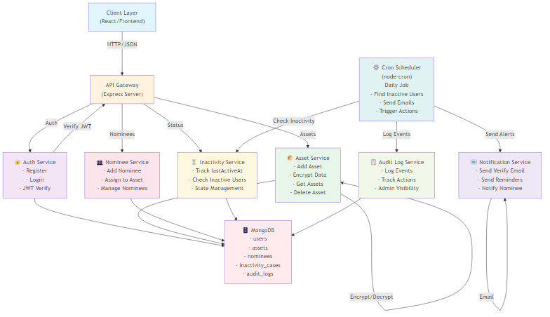
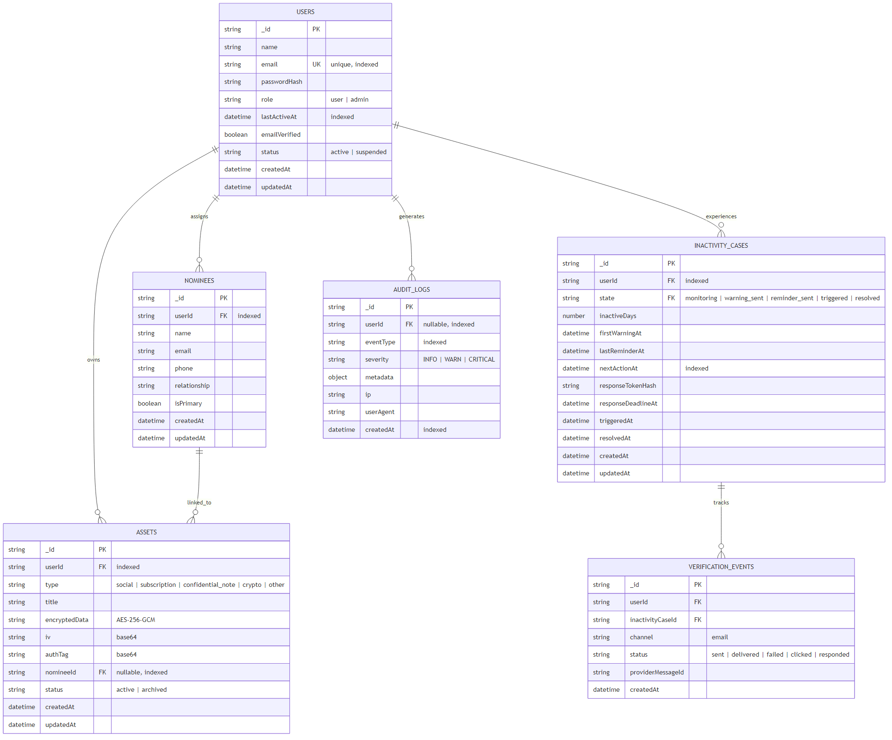
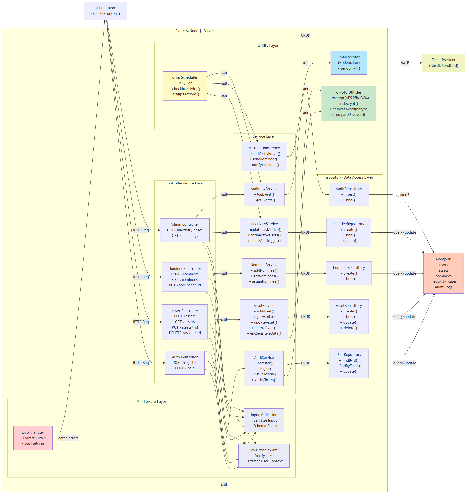
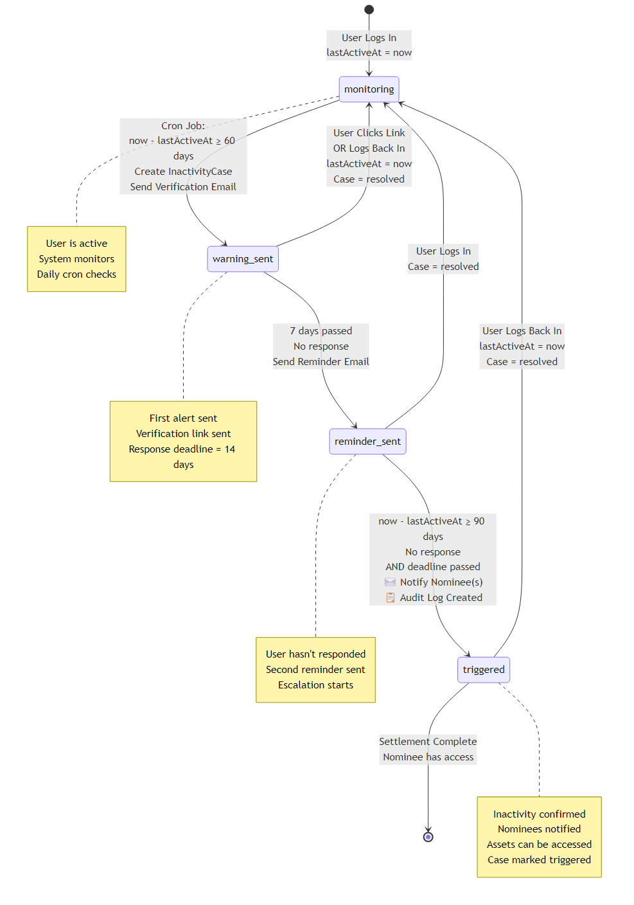
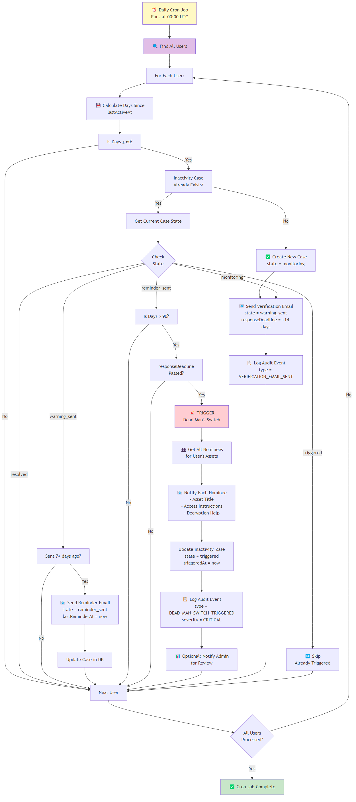

# 🏗️ Digital Asset Inheritance System (DAIS)

A secure backend system that allows users to manage their digital assets and define inheritance rules in case of prolonged inactivity. Built with Node.js, Express, MongoDB, and automated workflow management using cron jobs.

---

## 📋 Table of Contents

1. [Overview](#overview)
2. [Core Features](#core-features)
3. [Technology Stack](#technology-stack)
4. [System Architecture](#system-architecture)
5. [Database Design](#database-design)
6. [Backend Service Architecture](#backend-service-architecture)
7. [Dead Man's Switch Workflow](#dead-mans-switch-workflow)
8. [Cron Job Execution](#cron-job-execution)
9. [Installation & Setup](#installation--setup)
10. [API Endpoints](#api-endpoints)
11. [Security Features](#security-features)
12. [Project Structure](#project-structure)

---

## 🎯 Overview

**DAIS** (Digital Asset Inheritance System) solves a critical problem: **What happens to your digital assets if you suddenly pass away or become incapacitated?**

The system implements a "Dead Man's Switch" mechanism that:

- Monitors user activity through login timestamps
- Sends periodic verification emails if inactivity is detected
- Notifies designated nominees if the user doesn't respond
- Provides secure access to encrypted digital assets

---

## ✨ Core Features

### 1. **Secure User Authentication**

- JWT-based token authentication
- Bcrypt password hashing (12+ salt rounds)
- Email verification workflow
- Session tracking via `lastActiveAt`

### 2. **Digital Asset Management**

- Add/store digital assets (social media, subscriptions, notes, crypto, etc.)
- AES-256-GCM encryption for sensitive data
- Asset revocation and archival
- Nominee assignment per asset

### 3. **Inactivity Tracking & Dead Man's Switch**

- Automatic inactivity detection (60+ days)
- Multi-stage verification workflow
  - Warning email (Day 60)
  - Reminder emails (Day 60+7d, 60+14d, etc.)
  - Trigger at Day 90+ with no response
- Nominee notification with access instructions

### 4. **Automated Scheduling**

- Daily cron job using `node-cron`
- Checks all users for inactivity
- Sends emails and triggers actions
- No manual intervention required

### 5. **Comprehensive Audit Logging**

- All sensitive actions logged (login, asset creation, emails sent, triggers)
- Admin dashboard for event review
- Compliance-ready audit trail

### 6. **Multi-Role Access**

- User role: manage own assets and nominees
- Nominee role: receive notifications and access assets when triggered
- Admin role: review logs and system health

---

## 🛠 Technology Stack

| Component            | Technology                     |
| -------------------- | ------------------------------ |
| **Backend**          | Node.js, Express.js            |
| **Database**         | MongoDB                        |
| **Authentication**   | JWT                            |
| **Scheduler**        | node-cron                      |
| **Email Service**    | Nodemailer (Gmail/SendGrid)    |
| **Password Hashing** | bcrypt                         |
| **Data Encryption**  | Node.js crypto (AES-256-GCM)   |
| **Validation**       | express-validator              |
| **Environment**      | dotenv                         |
| **Frontend**         | React (separate client folder) |

---

## 🏗 System Architecture

Shows all core services (Auth, Asset, Nominee, Inactivity, Notification, Cron, Audit, Database) and their interactions.



---

## 🗄️ Database Design

### Entity-Relationship Diagram

Detailed database schema showing all collections, fields, relationships, and indexed fields.



### Collections Overview

| Collection              | Purpose        | Key Fields                                       |
| ----------------------- | -------------- | ------------------------------------------------ |
| **users**               | User accounts  | email (unique), passwordHash, lastActiveAt, role |
| **nominees**            | Beneficiaries  | userId, email, phone, relationship, isPrimary    |
| **assets**              | Digital assets | userId, type, encryptedData, nomineeId           |
| **inactivity_cases**    | Workflow state | userId, state, firstWarningAt, triggeredAt       |
| **audit_logs**          | Event logging  | userId, eventType, severity, metadata            |
| **verification_events** | Email tracking | inactivityCaseId, status, delivery info          |

---

## 🔄 Backend Service Architecture

Layered architecture showing middleware, controllers, services, repositories, and utilities.



---

## 🚨 Dead Man's Switch Workflow

State machine showing the lifecycle of inactivity detection with 5 states and multiple transition paths.



---

## ⚙️ Cron Job Execution

Detailed workflow showing the daily cron job logic for checking inactivity, sending emails, and triggering the Dead Man's Switch.



---

## 🚀 Installation & Setup

### Prerequisites

- Node.js 16+ and npm
- MongoDB (local or cloud instance)
- Nodemailer-compatible email service (Gmail, SendGrid, etc.)

### Backend Setup

1. **Clone the repository**

   ```bash
   git clone <repo-url>
   cd Digital\ Asset\ Inheritance\ System\ \(DAIS\)
   ```

2. **Install dependencies**

   ```bash
   cd server
   npm install
   ```

3. **Create `.env` file** in `server/` directory:

   ```env
   # Server
   PORT=5000
   NODE_ENV=development

   # Database
   MONGODB_URI=mongodb://localhost:27017/dais

   # JWT
   JWT_SECRET=your_super_secret_jwt_key_here_min_32_chars
   JWT_EXPIRY=7d

   # Email Service
   EMAIL_SERVICE=gmail
   EMAIL_USER=your_email@gmail.com
   EMAIL_PASSWORD=your_app_password
   EMAIL_FROM=noreply@dais.com

   # Encryption
   ENCRYPTION_KEY=your_32_char_base64_encoded_key

   # Cron Schedule (0 0 * * * = daily at midnight UTC)
   CRON_SCHEDULE=0 0 * * *

   # Inactivity Thresholds (in days)
   WARNING_THRESHOLD=60
   TRIGGER_THRESHOLD=90
   REMINDER_INTERVAL=7
   RESPONSE_GRACE_PERIOD=14
   ```

4. **Generate Encryption Key**

   ```bash
   node -e "console.log(require('crypto').randomBytes(32).toString('base64'))"
   ```

5. **Start MongoDB**

   ```bash
   # If using local MongoDB
   mongod
   ```

6. **Run the server**

   ```bash
   npm start
   ```

   Or for development with auto-reload:

   ```bash
   npm run dev
   ```

### Frontend Setup

1. **Navigate to frontend**

   ```bash
   cd ../client
   npm install
   ```

2. **Create `.env` file**:

   ```env
   REACT_APP_API_URL=http://localhost:5000/api
   REACT_APP_JWT_STORAGE_KEY=dais_token
   ```

3. **Start React app**
   ```bash
   npm start
   ```

---

## 📡 API Endpoints

### **Auth Endpoints**

```
POST   /api/auth/register          - Register new user
POST   /api/auth/login             - User login, returns JWT
GET    /api/auth/verify            - Verify email token
POST   /api/auth/logout            - Logout (clear token)
GET    /api/auth/me                - Get current user profile
```

### **Asset Endpoints**

```
POST   /api/assets                 - Create new digital asset
GET    /api/assets                 - List user's assets
GET    /api/assets/:id             - Get single asset details
PUT    /api/assets/:id             - Update asset
DELETE /api/assets/:id             - Delete/archive asset
```

### **Nominee Endpoints**

```
POST   /api/nominees               - Add new nominee
GET    /api/nominees               - List nominees
PUT    /api/nominees/:id           - Update nominee
DELETE /api/nominees/:id           - Delete nominee
POST   /api/nominees/:id/assign    - Assign nominee to assets
```

### **Admin Endpoints**

```
GET    /api/admin/inactivity-cases - List all inactivity cases
GET    /api/admin/logs             - View audit logs
GET    /api/admin/logs/:userId     - View logs for user
POST   /api/admin/force-check      - Manually trigger cron job
```

---

## 🔐 Security Features

### **Password Security**

- Bcrypt hashing with 12+ salt rounds
- No plaintext storage
- Constant-time comparison for auth

### **Data Encryption**

- AES-256-GCM for sensitive asset data
- Random IV for each encryption
- Authentication tag for integrity
- Keys stored in environment variables only

### **API Security**

- JWT token-based authentication
- Token expiration (7 days by default)
- Rate limiting on auth endpoints
- Input validation & sanitization
- CORS configured for frontend
- Helmet.js for security headers

### **Database Security**

- Unique indexes on email
- Connection pooling
- Query parameter binding (no SQL injection)
- Data validation at schema level

### **Audit & Compliance**

- All sensitive operations logged
- Immutable audit trail
- User activity tracking
- IP and user-agent logging
- Timestamps for all events

---

## 📁 Project Structure

```
DAIS/
├── server/                    # Backend (Node.js + Express)
│   ├── src/
│   │   ├── controllers/       # Route handlers
│   │   ├── services/          # Business logic
│   │   ├── repositories/      # MongoDB access
│   │   ├── models/            # MongoDB schemas
│   │   ├── middleware/        # JWT, validation, error handling
│   │   ├── utils/             # Crypto, email, logger
│   │   ├── routes/            # API routes
│   │   ├── config/            # Configuration
│   │   └── app.js             # Express app setup
│   ├── .env                   # Environment variables
│   ├── package.json
│   └── server.js              # Entry point
│
├── client/                    # Frontend (React)
│   ├── src/
│   │   ├── components/        # React components
│   │   ├── pages/             # Page components
│   │   ├── services/          # API client
│   │   ├── hooks/             # Custom hooks
│   │   └── App.js
│   ├── .env
│   └── package.json
│
└── README.md                  # This file
```

---

## 🧪 Testing the System

### Manual Testing with Postman

1. **Register a user**

   ```json
   POST /api/auth/register
   {
     "name": "John Doe",
     "email": "john@example.com",
     "password": "SecurePass123!"
   }
   ```

2. **Login**

   ```json
   POST /api/auth/login
   {
     "email": "john@example.com",
     "password": "SecurePass123!"
   }
   ```

   Response includes JWT token.

3. **Add a nominee**

   ```json
   POST /api/nominees
   (Headers: Authorization: Bearer <token>)
   {
     "name": "Jane Doe",
     "email": "jane@example.com",
     "phone": "+1234567890",
     "relationship": "Sister",
     "isPrimary": true
   }
   ```

4. **Create an asset**
   ```json
   POST /api/assets
   (Headers: Authorization: Bearer <token>)
   {
     "type": "social",
     "title": "Facebook Account",
     "encryptedData": "user@facebook.com:password123",
     "nomineeId": "<nominee_id>"
   }
   ```

### Automated Testing

- Unit tests for services (using Jest)
- Integration tests for API endpoints
- Cron job simulation tests

---

## 📊 Default Timing Configuration

| Phase            | Days                       | Action                                       |
| ---------------- | -------------------------- | -------------------------------------------- |
| **Monitoring**   | 0-60                       | Track user activity                          |
| **Warning**      | 60+                        | Send first verification email                |
| **Reminder**     | 60+7                       | Send reminder email (repeats every 7 days)   |
| **Trigger**      | 90+                        | Dead Man's Switch activated, notify nominees |
| **Grace Period** | 14 days from first warning | Response deadline                            |

### Example Timeline

- **Day 0**: User logs in → `lastActiveAt = Day 0`
- **Day 60**: Cron sends verification email
- **Day 67**: Cron sends reminder (no response yet)
- **Day 74**: Cron sends another reminder
- **Day 90 (with no login/response)**: Dead Man's Switch triggers
  - Nominees are notified
  - Audit log recorded
  - Case marked as "triggered"
- **Any time after Day 60**: User logs in → Case marked "resolved"

---

## 🐛 Troubleshooting

### Cron Job Not Running

- Check if `node-cron` is installed
- Verify `CRON_SCHEDULE` in `.env`
- Check server logs for errors
- Ensure MongoDB connection is active

### Emails Not Sending

- Verify SMTP credentials in `.env`
- Check email service (Gmail: enable "Less Secure Apps" or use App Passwords)
- Check spam folder for test emails
- Verify `EMAIL_FROM` address matches authenticated user

### Encryption Issues

- Ensure `ENCRYPTION_KEY` is 32 characters (base64)
- Never change the key mid-production (data will be unrecoverable)
- Verify IV and authTag are stored with encrypted data

---

## 📚 Additional Resources

- [MongoDB Documentation](https://docs.mongodb.com/)
- [Express.js Guide](https://expressjs.com/)
- [JWT Best Practices](https://tools.ietf.org/html/rfc7519)
- [Node.js Crypto Module](https://nodejs.org/api/crypto.html)
- [Nodemailer Documentation](https://nodemailer.com/)

---

## 📝 License

This project is developed for educational and professional purposes.

---

## 🤝 Contributing

Guidelines for contributing to this project (if applicable):

1. Fork the repository
2. Create a feature branch (`git checkout -b feature/amazing-feature`)
3. Commit changes (`git commit -m 'Add amazing feature'`)
4. Push to branch (`git push origin feature/amazing-feature`)
5. Open a Pull Request

---

**Last Updated**: March 20, 2026

**System Version**: 1.0.0 (Alpha)

**Status**: 🟡 In Development
